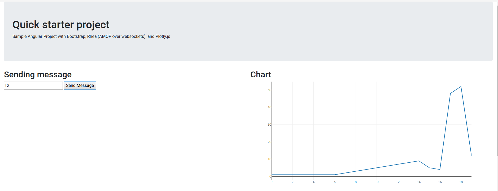

# Demo of an HTML 5 Angular application with Active MQ & Fuse backend

This demos shows how Angular 5 configured with Bootstrap, plotly.js for charts and plots can interact with a back end application such as Fuse through AMQP messaging.

Graphs update in real time as messages are sent from the backend to the browser.

## Prerequisites

* Have npm installed (optional)
* Install [angular-cli](https://angular.io/guide/quickstart) : `npm install -g @angular/cli` (optional)

* Have AMQ 7 installed and running
	* [Download AMQ version 7.0.0+ here](https://developers.redhat.com/products/amq/download/)
	* unzip package `unzip jboss-amq-7.0.0.redhat-1-bin.zip`
	* create a test instance

			cd jboss-amq-7.0.0.redhat-1/bin
			./artemis create  --user admin --password admin --allow-anonymous Y ./../instances/eventbrk
			cd ./../instances/eventbrk/bin
			./artemis run

* Have maven installed
  * use the following maven settings  to enable  the right repositories
    * fuseapp/configuration/settings.xml

## Easiest way to run the demo
    cd fuseapp
    mvn --settings configuration/settings.xml spring-boot:run

Open your browser at http://localhost:8090/

## If you want to customize and rebuild the angular app

    cd angularapp
    npm install

To rebuild the application

    ng build

To start serving the application

    ng serve

## How to build the angular app from scratch

See the following template :
    https://github.com/alainpham/angular-amq-bootstrap-template
